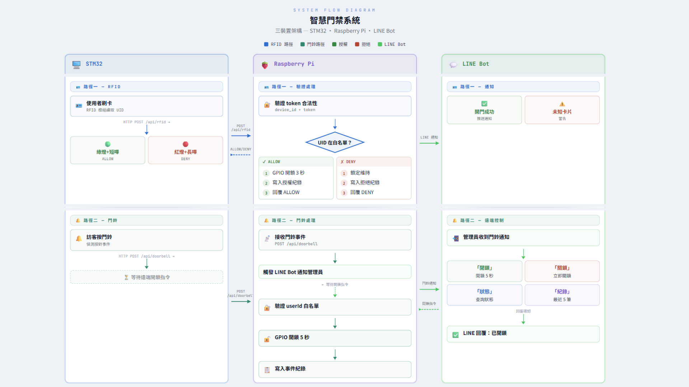

# Smart Doorbell and RFID Access Control System

基於 STM32L475 IoT Discovery Kit 與 Raspberry Pi 的智慧門鈴暨 RFID 門禁系統。使用者可透過 LINE Bot 遠端控制門鎖、接收門鈴通知與門口拍照，也可透過 RFID 卡片在本地開鎖。

## 系統流程圖

## 功能

- **RFID 門禁** — 刷卡後由伺服器驗證 UID，通過則自動開鎖
- **門鈴通知** — 按下門鈴按鈕，Raspberry Pi 拍照並透過 LINE 推播給管理員
- **LINE Bot 遠端控制** — 傳送指令即可開鎖 / 上鎖 / 查詢狀態 / 查看歷史紀錄
- **門口拍照** — 透過 LINE 指令觸發 USB Webcam 拍攝即時照片
- **Long Polling** — STM32 以 long poll 方式即時接收 LINE 下達的指令，延遲約 350ms 以內

## 硬體

| 元件 | 介面 | 腳位 |
|------|------|------|
| RC522 RFID Reader | SPI1 | CS=PA3, RST=PA4 |
| SG90 360° 連續旋轉伺服馬達 | TIM2 CH1 PWM | PA15 |
| 門鈴按鈕 | GPIO EXTI | PC13 |
| ISM43362 WiFi 模組 | SPI3 | (板載) |
| 簧片開關 (門鎖位置偵測) | GPIO Input | PD14 |
| USB Webcam | USB | Raspberry Pi |

## Branch 結構

| Branch | 內容 | 說明 |
|--------|------|------|
| **`rpi`** | Raspberry Pi 代碼 | Flask 伺服器、LINE Bot、Webcam 拍照、STM32 WiFi 橋接 |
| **`stm32`** | STM32 代碼 | STM32CubeIDE 專案、FreeRTOS 任務、RFID / 伺服馬達 / WiFi 驅動 |

### Raspberry Pi (`rpi` branch)

- Python 3 / Flask
- LINE Messaging API v3
- OpenCV (Webcam 拍照)
- SQLite (歷史紀錄)
- ngrok (HTTPS 通道)

### STM32 (`stm32` branch)

- STM32CubeIDE / STM32 HAL
- FreeRTOS (CMSIS_RTOS_V2)
- 3 個使用者任務：RFIDTask、ButtonTask、WiFiTask
- ISM43362 WiFi 驅動 + HTTP Client
- RC522 RFID 驅動 (SPI)
- SG90 PWM 控制 + 簧片開關旋轉計數
